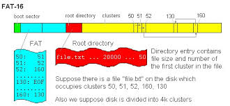
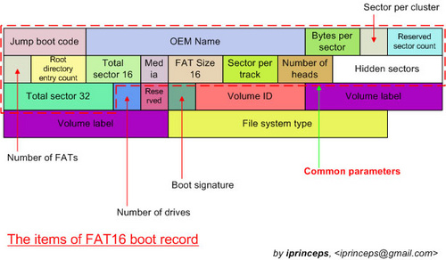
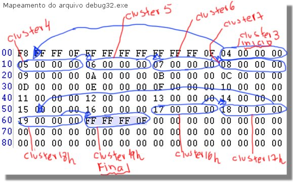
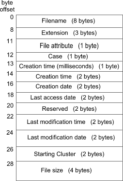

# FAT16

O sistema de arquivos FAT16 consiste em quatro regiões distintas:

1. Setor de boot
2. Tabela de Alocação de Arquivos (FAT Table)
3. Diretório Raiz
4. Região de Dados (Clusters)



## Setor de Boot

O setor de boot consiste em um único setor de 512 bytes que contém dois elementos,
o programa de bootstrap, carregado pela BIOS para iniciar o sistema operacional,
e o *Bios Parameter Block*. O programa de boot não nos interessa. O BPB contém
as informações do volume FAT16 que iremos operar, então ter acesso à ele é importantíssimo.

Este é o layout em disco do BPB:



Não será necesário lê-lo manualmente, já que o professor proveu a função `void rfat(FILE*, struct fat_bpb*)`
que a lê. Esta função é chamada na main e é passada ao corpo da função dos comandos
que implementaremos, então ela já vem lida na variavel `bpb`.

Este é a composição de `struct fat_bpb`:

```c
struct fat_bpb {                /* bios Parameter block */
	uint8_t jmp_instruction[3]; /* code to jump to the bootstrap code */
	unsigned char oem_id[8];    /* Oem ID: name of the formatting OS */

	uint16_t bytes_p_sect;      /* bytes per sector */
	uint8_t sector_p_clust;     /* sector per cluster */
	uint16_t reserved_sect;     /* reserved sectors */
	uint8_t n_fat;              /* number of FAT copies */
	uint16_t possible_rentries; /* number of possible root entries */
	uint16_t snumber_sect;      /* small number of sectors */

	uint8_t media_desc;         /* media descriptor */
	uint16_t sect_per_fat;      /* sector per FAT */
	uint16_t sect_per_track;    /* sector per track */
	uint16_t number_of_heads;   /* number of heads */
	uint32_t hidden_sects;      /* hidden sectors */
	uint32_t large_n_sects;     /* large number of sectors */
};
```

Os campos importantes são `bytes_p_sect` que dá a quantidade de bytes em um setor/cluster, usado
quando formos lêr/copiar arquivos; `sector_p_clust`, pelo mesmo motivo; `possible_rentries`, que
dá a quantidade de entradas alocadas na estrutura do diretório raíz, usado para acessar o mesmo.

## Tabela FAT

Em seguida, a tabela FAT consiste em um array de "ponteiros", endereços de clusters relativos
ao começo da região de dados. Cada entrada na FAT aponta para o próximo bloco do arquivo, e
para indicar o fim do arquivo, uma entrada FAT é marcada com um valor maior que 0xFFF7.

As duas primeiras entradas da FAT são especiais e não devem ser usadas para guardar um ponteiro
de cluster de arquivo. Como a FAT "verdadeira" só começa da entrada dois em diante, todos os
ponteiros, quando dereferenciados, devem ser subtraidos do valor dois.



A formula para descobrir o endereço final de um cluster em disco é:

```
real_cluster_address = data_start + (cluster_number - 2) * bpb->bytes_p_sect * bpb->sector_p_clust
```

O endereço de `data_start` pode ser obtido com a função provida pelo professor `bpb_fdata_address()`.

O `real_cluster_address` pode ser então usado para ler os dados do arquivo diretamente do disco, por exemplo,
via a função `read_data(fp, real_cluster_address, ...)`.

Entradas NULLas na FAT são clusters livres.

Caso o arquivo não caiba em um só cluster, deve-se seguir os ponteiros da FAT a-là lista encadeada.

## Diretório Raiz

O diretório raiz é uma array em disco que contém entradas de diretório, que guardam informações sobre os
arquivos/outros diretórios. A entrada mais importante de uma `struct fat_dir` é o `start_cluster`, que guarda
qual é o cluster inicial do arquivo.



Em código, é representada via a seguinte struct:

```c
struct fat_dir {
	unsigned char name[11];    /* Short name + file extension */
	uint8_t attr;              /* file attributes */
	uint8_t ntres;             /* reserved for Windows NT, Set value to 0 when a file is created. */
	uint8_t creation_stamp;    /* milisecond timestamp at file creation time */
	uint16_t creation_time;    /* time file was created */
	uint16_t ctreation_date;   /* date file was created */
	uint16_t last_access_date; /* last access date (last read/written) */
	uint16_t reserved_fat32;   /* reserved for fat32 */
	uint16_t last_write_time;  /* time of last write */
	uint16_t last_write_date;  /* date of last write */
	uint16_t starting_cluster; /* starting cluster */
	uint32_t file_size;        /* 32-bit */
};
```

## Região de dados

Está é uma área de dados brutos, então não há estrutura. Para navegar esta área,
deve-se interpretar a tabela FAT.
